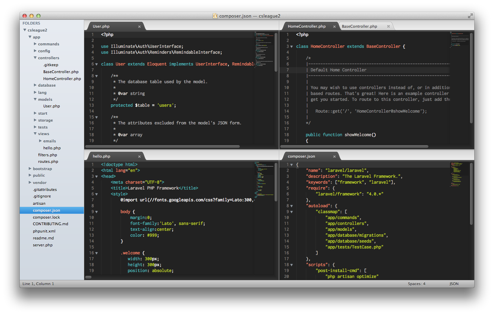

# 每周小技巧

你觉得上周的Emmet wrap技巧怎么样? 有没有觉得很方便?

这周的技巧是使用很少使用大小写转换函数.你可能不会每天都使它们, 但是当你有这个需求的时候它们会帮你节省大量的时间.

常见的转化是将你的文本转换为大写,小写,标题格式-我发现我会在用一个文本列表创建变量时用到它们. 使用方法, 选中你希望转化的文字, 打开命令面板[^注1], 键入`convert case`.

![][1]

接下来只需要选中你希望的然后按下enter键即可.

# 插件 & 资源 笔记

[WordPressDev][2] 是一个为使用WordPress工作的人准备的出色且轻量的插件. 他提供了一系列的命令比如打开配置文件,开关debug,切换数据库等.可以从Package Control获取它.

[CSS Extended Completions][2]为那些不使用Emmet的人们提供了一个综合的CSS自动补全功能!.

[Unity Complettions][3] 是一个Unity开发者的必备插件. 这个插件提供了Unity的类,变量,函数的自动补全功能. 它在Unity的支持的Javascript,C#,Boo语言下工作.

# 主题广场

![][4]

这周的主题是一个叫[Fizzy][5]的黑色主题. 我喜欢这个主题因为它使用明亮的色彩与黑色的背景形成对比 - 使用 Package Control来获取它.

[^注1]: `cmd/ctrl+shift+p`

[1]: 05-01-29-001.png
[2]: https://github.com/subhaze/CSS-Extended
[3]: https://github.com/oferei/sublime-unity-completions
[4]: 05-01-29-002.png
[5]: https://github.com/xandrcouk/fizzy-theme
2]: https://github.com/huntlyc/Sublime-Wordpress-Dev-Plugin